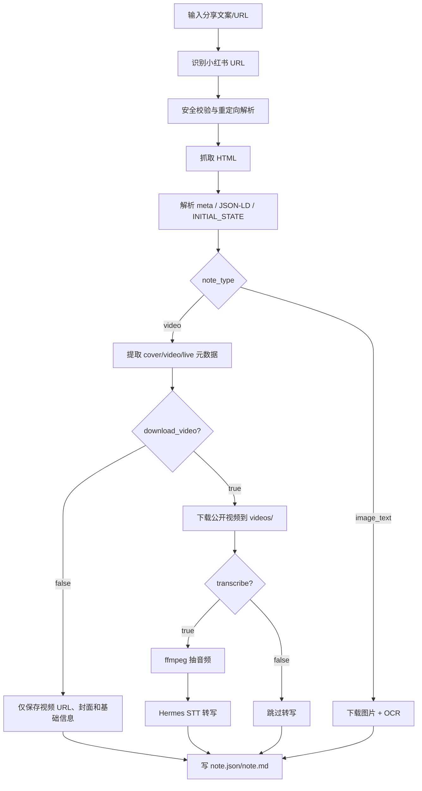

# xhs_extract_note 支持小红书视频类提取设计方案

日期：2026-05-21
状态：团队评审稿
涉及模块：`plugins/xiaohongshu/tools.py`, `tests/plugins/test_xiaohongshu_plugin.py`

## 1. 背景

现有 `xhs_extract_note` 工具定位为“单条小红书图文笔记提取”。当前能力包括：

- 从分享文案中识别小红书/xhslink URL；
- 解析短链和长链；
- 提取 `note_id`、标题、正文、作者、图片 URL；
- 下载图片到 Hermes cache；
- 可选调用 vision 做图片 OCR；
- 输出 `note.json` 和 `note.md`。

四季光色/小红书运营场景里，视频笔记是高频输入。用户希望把视频类小红书笔记也纳入“收集 → 整理 → 表达”的知识库闭环，尤其是：

- 提取视频标题、正文、封面；
- 保存可访问的视频资源引用；
- 从视频音频中转写逐字稿；
- 将逐字稿作为后续爆款拆解、脚本复写、知识库沉淀的核心素材。

参考 AnyToCopy 小红书页面的产品体验，用户预期通常包含：粘贴小红书链接、一键解析视频文案、提取视频/音频/封面/图集、批量打包下载。Hermes 版本应吸收其“低门槛、一次性结构化输出”的体验，但不复制高风险能力。

## 1.1 AnyToCopy 参考拆解

AnyToCopy 的小红书视频页对外展示了几类能力：

- 一键解析小红书链接，提取笔记标题、正文、图片、视频、Live 图；
- 视频笔记基础信息几秒内完成，语音转文字需要服务器转存和 AI 分析，通常 30 秒到几分钟；
- 视频文案识别受视频时长、文件大小、音频清晰度影响；
- 支持单个笔记内图片/视频批量下载和 ZIP 打包；
- 产品文案强调“无水印”“去水印”“批量保存收藏”。

Hermes 不应照搬其完整下载/去水印/批量能力。团队应只借鉴三点：

1. **单入口体验**：用户粘贴一条链接即可得到结构化结果；
2. **分层结果**：基础元数据快速返回，转写作为耗时增强能力；
3. **可归档产物**：输出文件同时适合人读（Markdown）和 Agent 读（JSON）。

明确不借鉴：

- 不承诺去水印；
- 不做跨笔记批量抓取；
- 不做 ZIP 打包和素材搬运口径；
- 不绕过登录、风控或权限限制。

来源：

- AnyToCopy 小红书视频文案提取页：https://www.anytocopy.com/xiaohongshu

## 2. 设计目标

### 2.1 P0 目标

让 `xhs_extract_note` 同时支持图文和视频笔记，并保持向后兼容：

1. 输入仍然是一个用户主动提交的小红书链接或分享文案；
2. 输出仍然包含 `note.json` 和 `note.md`；
3. 新增 `note_type` 字段，取值 `image_text | video | unknown`；
4. 视频笔记新增 `video`、`audio`、`transcript` 三组结构化字段；
5. 支持从页面 HTML/initial state/meta 标签中提取视频 URL、封面 URL、时长、宽高、音频信息；
6. 默认下载公开视频文件到本地 cache，并受 `max_video_mb` 硬上限保护；
7. 默认从下载视频中抽取音频并调用 Hermes 现有 STT 生成逐字稿，失败时降级为 warning；
8. 所有下载、转写失败都降级为 warning，不影响基础元数据输出。

### 2.2 P1 目标

在 P0 稳定后补齐：

- Live 图识别与下载；
- 多视频或视频+图集混合笔记；
- 可选生成视频关键帧截图；
- transcript 分段和时间戳；
- 面向内容拆解的 `script_analysis.md`。

### 2.3 非目标

本阶段不做：

- 不做搜索、批量爬取、账号自动化浏览；
- 不绕过登录、权限、风控、反爬或 DRM；
- 不承诺“无水印”或“去水印”；
- 不自动发布、搬运或二次分发视频；
- 不接入第三方解析服务作为默认依赖。

原因：Hermes 插件应服务用户对自己提交链接的本地知识整理，而不是成为内容搬运工具。

## 3. 产品口径

工具说明从“image-text note extraction”调整为：

> Extract one user-submitted Xiaohongshu note URL into local structured artifacts. Supports image-text and public video notes, including metadata, images/covers, default bounded media download, OCR, and default speech-to-text transcript.

中文产品口径：

> 粘贴一条小红书链接，Hermes 将它整理成可归档的本地笔记：标题、正文、图片/封面、视频资源、音频逐字稿和后续创作素材。工具只处理用户主动提供的单条公开链接，不做批量爬取和去水印承诺。

## 4. 用户故事

### 4.1 美学博主运营

益达把一条穿搭视频爆款链接发给爱马仕：

1. 爱马仕提取标题、正文、封面和视频；
2. 下载视频或保留视频资源引用；
3. 转写视频口播为逐字稿；
4. 输出 `note.md`；
5. 后续 skill 拿 transcript 拆解前 15 秒钩子、脚本结构、卖点节奏。

### 4.2 求职课程博主运营

路飞把竞品 Web Coding 课程视频链接发给爱马仕：

1. 提取逐字稿；
2. 识别视频里的课程承诺、用户痛点、转化话术；
3. 生成自己的短视频逐字稿草稿。

### 4.3 知识库沉淀

Agent 定期读取 `cache/xiaohongshu/<note_id>/note.json`：

1. 将正文、OCR、transcript 写入长期记忆；
2. 将视频封面和关键帧作为视觉素材；
3. 保留 source/resolved URL 用于溯源。

## 5. 工具接口设计

现有参数：

```json
{
  "url": "string",
  "ocr": true,
  "max_images": 9,
  "vision_model": "string"
}
```

建议扩展为：

```json
{
  "url": "string",
  "ocr": true,
  "max_images": 9,
  "vision_model": "string",
  "download_video": true,
  "transcribe": true,
  "stt_model": "string",
  "max_video_mb": 100,
  "include_keyframes": false
}
```

字段说明：

| 参数 | 默认 | 阶段 | 说明 |
|---|---:|---|---|
| `download_video` | `true` | P0 | 是否下载公开视频。默认 true，配合 `max_video_mb` 控制风险 |
| `transcribe` | `true` | P0 | 是否尝试生成逐字稿。默认 true，下载或转写失败时降级为 warning |
| `stt_model` | 空 | P0 | 传给 `tools.transcription_tools.transcribe_audio` 的模型 |
| `max_video_mb` | `100` | P0 | 视频下载大小上限 |
| `include_keyframes` | `false` | P1 | 是否抽关键帧，依赖 ffmpeg |

兼容策略：

- 不传新参数时，图文笔记行为不变；
- 视频笔记默认下载视频并尝试转写；
- 如果调用方显式传入 `download_video=false`，则不下载视频，并跳过转写或返回明确 warning；
- `max_images` 继续作用于图集和封面下载数量。

## 6. 数据模型设计

### 6.1 ParsedNote 扩展

当前：

```python
@dataclass
class ParsedNote:
    note_id: str
    source_url: str
    resolved_url: str
    title: str = ""
    content: str = ""
    author: dict[str, str] = field(default_factory=dict)
    image_urls: list[str] = field(default_factory=list)
    raw_metadata: dict[str, Any] = field(default_factory=dict)
    warnings: list[str] = field(default_factory=list)
```

建议：

```python
@dataclass
class ParsedVideo:
    source_url: str = ""
    cover_url: str = ""
    duration_ms: int | None = None
    width: int | None = None
    height: int | None = None
    format: str = ""
    bitrate: int | None = None

@dataclass
class ParsedNote:
    note_id: str
    source_url: str
    resolved_url: str
    title: str = ""
    content: str = ""
    note_type: str = "unknown"
    author: dict[str, str] = field(default_factory=dict)
    image_urls: list[str] = field(default_factory=list)
    videos: list[ParsedVideo] = field(default_factory=list)
    live_photo_urls: list[str] = field(default_factory=list)
    raw_metadata: dict[str, Any] = field(default_factory=dict)
    warnings: list[str] = field(default_factory=list)
```

### 6.2 note.json 输出

视频笔记输出示例：

```json
{
  "platform": "xiaohongshu",
  "note_id": "65b7b9d00000000001001234",
  "note_type": "video",
  "source_url": "https://xhslink.com/a/xxx",
  "resolved_url": "https://www.xiaohongshu.com/explore/...",
  "title": "秋冬通勤穿搭",
  "content": "正文文案...",
  "author": {},
  "images": [
    {
      "index": 1,
      "role": "cover",
      "source_url": "https://sns-img...",
      "local_path": ".../images/01.jpg",
      "ocr_text": "",
      "ocr_status": "ok"
    }
  ],
  "videos": [
    {
      "index": 1,
      "source_url": "https://sns-video...",
      "local_path": ".../videos/01.mp4",
      "download_status": "ok",
      "duration_ms": 28100,
      "width": 1080,
      "height": 1920,
      "bytes": 12345678
    }
  ],
  "audio": {
    "source": "video:1",
    "local_path": ".../audio/01.m4a",
    "extract_status": "ok"
  },
  "transcript": {
    "status": "ok",
    "provider": "local",
    "model": "base",
    "text": "今天这条视频...",
    "segments": []
  },
  "raw_metadata": {},
  "warnings": [],
  "extracted_at": "2026-05-21T..."
}
```

### 6.3 Markdown 输出结构

`note.md` 建议结构：

```markdown
# 标题

- platform: xiaohongshu
- note_id: ...
- note_type: video
- source_url: ...
- resolved_url: ...
- extracted_at: ...

## Body

正文文案

## Video

- source_url: ...
- local_path: ...
- duration: 00:28
- download_status: ok

## Transcript

逐字稿文本

## Image OCR

封面/图集 OCR

## Warnings
```

## 7. 提取流程



## 8. 解析策略

### 8.1 视频 URL 候选提取

新增 `_normalise_video_url` 和 `_is_likely_note_video_url`。

候选来源：

1. `og:video`, `twitter:player`, `video` meta；
2. `window.__INITIAL_STATE__` 中的 `video`, `videoInfo`, `media`, `stream`, `masterUrl`, `backupUrls`；
3. HTML 中的正则兜底，匹配 `sns-video`, `sns-video-hw`, `xhscdn.com` 等 host；
4. JSON walk 中 key 包含 `video`, `stream`, `h264`, `h265`, `media`, `url` 的字符串。

候选过滤：

- host 必须属于小红书/CDN 相关域；
- scheme 必须是 http/https；
- path 不得是 js/css/font/svg；
- 优先选择 mp4/m3u8 或 content-type 为 video 的资源；
- 同一 URL 去重。

### 8.2 note_type 判断

优先级：

1. 找到有效 video URL → `video`；
2. 找到 image URLs 且没有 video → `image_text`；
3. 仅有 title/body → `unknown`；
4. 如果 metadata 显示 `type=video` 但视频 URL 未提取，仍标记 `video` 并加 warning。

### 8.3 封面处理

视频封面视作 image record，新增 `role`：

- `cover`：视频封面；
- `gallery`：图集图片；
- `live_cover`：Live 图封面；
- `keyframe`：P1 关键帧。

这样现有 OCR 流程可复用。

## 9. 下载与转写设计

### 9.1 视频下载

新增：

```python
async def _download_video(
    url: str,
    destination: Path,
    referer: str,
    max_bytes: int,
) -> dict[str, Any]:
    ...
```

要求：

- 复用 `tools.url_safety.is_safe_url`；
- 复用 `_ssrf_redirect_guard`；
- 设置 `Referer` 为 note resolved URL；
- 流式下载，超过 `max_video_mb` 立即中止；
- 校验 content-type 或文件头；
- 支持 mp4；m3u8 先只记录 URL，不在 P0 下载分片；
- 失败时写 `download_status=failed` 和 warning。

目录：

```text
cache/xiaohongshu/<note_id>/
  note.json
  note.md
  images/
  videos/
  audio/
  keyframes/   # P1
```

### 9.2 音频抽取

如果下载到本地视频且 `transcribe=true`：

1. 检查 ffmpeg 是否可用；
2. 抽取音频到 `audio/01.m4a` 或 `audio/01.wav`；
3. 若 ffmpeg 不可用，跳过并 warning；
4. 默认配置会尝试受限下载并转写；如果下载失败，转写降级为 warning。

原因：

- 现有 `tools.transcription_tools` 支持 mp4/m4a/wav/webm 等；
- 直接把远程视频 URL 丢给 STT 不稳定，也不利于安全审计；
- 本地音频文件便于复用和溯源。

### 9.3 STT 转写

复用：

```python
from tools.transcription_tools import transcribe_audio
```

输出存入：

- `payload["transcript"]["text"]`
- `payload["transcript"]["status"]`
- `payload["transcript"]["provider"]`
- `payload["transcript"]["model"]`
- `payload["transcript"]["segments"]`（若 provider 返回）

失败场景：

- STT 未启用；
- 无 ffmpeg；
- 文件超过 STT 大小限制；
- 音频为空；
- 供应商 API 失败。

全部以 warning 返回，不让工具整体失败。

## 10. 安全、合规与边界

### 10.1 安全

必须保留：

- `_is_allowed_xhs_url`；
- `tools.url_safety.is_safe_url`；
- `_ssrf_redirect_guard`；
- host allowlist；
- 下载大小上限；
- 单链接处理，不批量 crawl。

新增：

- `max_video_mb` 硬上限；
- `download_video=true` 默认，必须受 `max_video_mb` 硬上限约束；
- m3u8 不递归下载；
- 对外部 CDN URL 只做小红书相关 host allowlist；
- 写入文件名只使用序号和安全后缀。

### 10.2 合规

产品文案避免：

- “去水印”；
- “无水印下载”；
- “破解”；
- “搬运”；
- “批量采集”。

建议文案：

- “公开视频资源归档”；
- “视频文案转写”；
- “用户提交链接的本地知识整理”；
- “保留原始来源与作者信息”。

输出中保留：

- `source_url`；
- `resolved_url`；
- 作者信息；
- 提取时间；
- warnings。

### 10.3 版权

工具只为用户归档和分析其主动提供的链接。最终产品层应提示：

> 请确认你有权保存、分析或复用该内容。Hermes 不授予任何二次分发授权。

## 11. 实现拆分

### Phase 1：数据模型与解析

修改：

- `ParsedNote` 新增 `note_type`, `videos`, `live_photo_urls`；
- 新增 `ParsedVideo`；
- `_collect_from_json` 同时收集 video candidates；
- `_extract_metadata_from_html` 返回 `videos`, `note_type`；
- `_parse_note` 写入 warnings。

测试：

- meta 中含 `og:video` 可提取；
- initial state 中含 `videoInfo.media.stream.h264[0].masterUrl` 可提取；
- 无视频但有图片仍为 `image_text`；
- metadata 显示 video 但无 URL 时 warning。

### Phase 2：输出兼容

修改：

- `_write_note_files` 支持 `videos/audio/transcript`；
- `_render_note_markdown` 增加 `## Video` 和 `## Transcript`；
- 返回摘要增加：
  - `note_type`
  - `video_count`
  - `downloaded_video_count`
  - `transcript_status`
  - `transcript_chars`

测试：

- 旧图文测试不改预期或只补 `note_type`；
- 新视频 payload 写 JSON/MD 成功；
- markdown preview 包含 Transcript 区块。

### Phase 3：视频下载

修改：

- 新增 `_looks_like_video`；
- 新增 `_download_video`；
- 新增 `_download_note_videos`；
- schema 增加 `download_video`, `max_video_mb`。

测试：

- mock httpx 返回 mp4 bytes；
- 超过 size limit 中止；
- 非视频 content-type 失败但工具成功返回 warning；
- `download_video=false` 时不请求视频 URL；
- 默认参数下视频笔记会尝试下载视频。

### Phase 4：音频转写

修改：

- 新增 `_extract_audio_from_video`；
- 新增 `_transcribe_video_audio`；
- schema 增加 `transcribe`, `stt_model`。

测试：

- monkeypatch ffmpeg 和 `transcribe_audio`；
- STT 成功写 transcript；
- STT 不可用写 warning；
- `transcribe=false` 时跳过；
- 默认参数下已下载视频会尝试抽音频并转写。

### Phase 5：P1 能力

可选：

- Live 图；
- keyframes；
- script analysis；
- zip 打包。

建议先不进入 P0，以免扩大风险面。

## 12. 测试验收

### 单元测试

新增测试文件仍放在 `tests/plugins/test_xiaohongshu_plugin.py`：

1. `test_extracts_video_metadata_from_meta_tags`
2. `test_extracts_video_metadata_from_initial_state`
3. `test_video_note_json_and_markdown_include_transcript`
4. `test_download_video_respects_explicit_disabled_flag`
5. `test_download_video_blocks_oversized_response`
6. `test_transcribe_video_audio_degrades_to_warning`
7. `test_default_video_note_downloads_and_transcribes_when_possible`

### 集成手测

准备 3 类链接：

1. 公开视频笔记；
2. 图文笔记；
3. 失效/需要登录的视频笔记。

验收：

- 图文笔记原行为不回退；
- 视频笔记至少能提取 title/body/cover/video metadata；
- 下载关闭时不产生大文件；
- 下载开启时本地生成 `videos/`；
- ffmpeg/STT 可用时生成 transcript；
- 任一媒体失败不导致工具整体失败。

## 13. 团队评审问题

1. 是否接受 `xhs_extract_note` 继续作为统一工具名，而不是新增 `xhs_extract_video`？
2. `download_video` 是否应默认 true？本方案按当前拍板改为 true，并用 `max_video_mb` 做硬保护。
3. 是否明确不做“去水印”产品口径？本方案建议不做。
4. P0 是否需要 m3u8 下载？本方案建议只记录 URL，不下载分片。
5. transcript 是否默认 true？本方案按当前拍板改为 true；失败只写 warning，不让工具整体失败。
6. 是否将 `script_analysis.md` 放进 P1，由后续小红书内容拆解 skill 负责？
7. 是否需要为四季光色单独加一层上游 skill，把 transcript 转成“前 15 秒钩子/结构/卖点/可复写脚本”？

## 14. 推荐决策

建议团队采用：

- 一个工具名：继续扩展 `xhs_extract_note`；
- 一个统一输出：`note.json` + `note.md`；
- 一个兼容模型：`note_type` 区分图文/视频；
- 一个业务默认：默认下载视频、默认转写，但受 `max_video_mb`、URL 安全校验和 warning 降级约束；
- 一个核心新增价值：视频笔记直接生成可供爆款拆解使用的逐字稿；
- 一个产品边界：只做用户提交链接的本地知识整理，不做去水印和批量搬运。

这样能最小改动接入现有 Hermes 插件体系，同时满足四季光色、小红书爆款拆解、路飞求职课程视频分析等业务场景。
